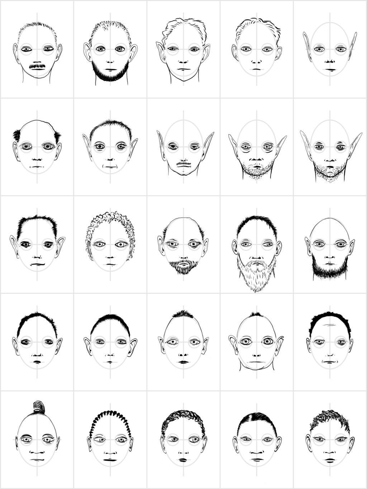

# Random Faces

The face generator is a web application that generates faces by
combinging various elements such as eyes, nose, mouth and hair into a
single picture.

## How to Contribute

The first thing I had to do was learning to draw faces. Check out
[How to Draw a Face](http://www.wikihow.com/Draw-a-Face) or a similar
resource.

The main difficulty when it comes to contributing is that you need to
provide the face elements – hair, eyes, nose, mouth – so that the
software can layer them over one another. Thus, they need to be in
more or less the same fixed positions.

Do you work with pen and paper, or do you work electronically?

I work with **pen and paper**. That's why I print out the
[empty PDF](empty.pdf) and start drawing my face elements using a blue
fountain pen. The empty.pdf file has basic face shapes that help me
draw the eyes always in the right spot, the mouth always in the right
spot, the beard always in the right spot, and so on.


If this work for you, print a bunch of empty.pdf sheets and start
drawing a row of noses, a row of mouths, a row of hair (or bald
heads), a row of ears, a row of chins (maybe with beard), and so on.
Scan what you draw and send me a mail (to
[Alex Schroeder](mailto:kensanata@gmail.com)) as soon as possible.
I'll set up a test account and we'll see how it goes, refining the
process as we go.


If you're like me, you'll agree that elves should have thinner faces
and dwarves should have rounder faces. That's what the
[elf PDF](elf.pdf) and the [dwarf PDF](dwarf.pdf) are for.

If you work **electronically** using a tablet or so, I would suggest
something else. Here's how I worked using my iPad and Procreate: I
created a new image by importing the [empty PNG](empty.png) and adding
a new layer for all the different elements: eyes, mouth, chin, ears,
nose, extra, and hair. I exported the whole image in PSD format,
keeping all the layers intact. If you got this far,
just [send it](mailto:kensanata@gmail.com) to me.



[Download PSD file](electronic-process.psd)

To get started, send me at bunch of noses, mouths, hair, ears, and
chins. The minimum is one each, but more is better, of course. 😄
Again, I'll set up a test account and we'll see how it goes. I think
getting feedback about the process is important. This will take a few
attempts, I think.

Later, we can use some other method to exchange files.

## File Names

It's important to get the file names right.

This application goes through the files in the [elements](elements)
folder for a given artist and picks out one of each for every
*element* of a face. These are the elements considered, in order:

* face
* eyes
* brows
* mouth
* chin
* ears
* nose
* extra (only 10% of all faces)
* horns
* bangs
* hair
* hat (only 10% of all faces)

The application also allows filtering by *type*.

* woman
* man
* elf
* dwarf
* and whatever single word you can come up with...

The file format for all the images is very simple:
`element_type_stuff.png`, e.g. `ears_elf_2.png`. Each of these files
is a *component* of a particular face.

There is a special type called "all". It is used when no file matching
the requested type is found.

Assume we want to support men, women and elves. The ears of men and
women are always the same. A typical filename for human ears might be
`ears_all_1.png`. When generating a face for a man and looking at
ears, no file matching `ears_man_*` is found and so a file matching
`ears_all_*` is taken (namely the file `ears_all_1.png` we just
mentioned). When generating a face for an elf, however, a file
matching `ears_elf_*` is found (namely the file `ears_elf_2.png` we
mentioned above) and thus the ears matching `ears_all_*` are never
considered for elves.

This results in a problem when adding a type when there was none
before. At first, we just had `hair_all_*.png`. Then we decided that
here was a hairdo for a woman and created `hair_woman_3.png`. From now
on, the "all" type will no longer be used when generating a face for a
woman. One solution is to rename `hair_all_1.png` to
`hair_man_woman_1.png`. Now it will be used for both men and women but
not for dwarves or elves.

## Nickname, Name, License

All the files for each artist go into a directory with a short
nickname, e.g. "alex". The artist's name and the link to their
homepage is extracted from the `README.md` file in their directory.
Take a look at [mine](share/alex/README.md), for example.

Currently, the code assumes that all artists have dedicated their
files to the
[public domain](https://creativecommons.org/publicdomain/zero/1.0/).

## Processing

If you're running your own copy of the face generator, here's the post
processing you need to do with scanned images:

1. Scan the image and crop it using [The Gimp](http://www.gimp.org/)
   or whatever else you feel comfortable with. Cropping is important.
   The result must be an image 2250 pixels wide and 3000 pixels high.
   Rescale the image if necessary.

2. Clean up the image using [ImageMagick](http://www.imagemagick.org/)
   and the following command line: `convert -blur 0x1 +dither -remap
   blau.png scan1.jpg source1.png` – this forces the image to use the
   [blue](blau.png) Palette (and loses the grid). We're also moving
   from JPG (which is what your scanner probably produced) to PNG. As
   for transparency: If your PNG files use "indexed mode" or a
   *palette* then it will work if you have a transparent color. If you
   don't (because you're converting a JPG to a PNG as you did just
   now) then *white* is considered to be *transparent* when merging
   the various elements. If your PNG files use "RGB mode" or *true
   color*, then it will also work if you use an alpha channel.
   Unfortunately, this means that it will *not* work if you use RGB
   mode and no alpha channel—such elements will cover all previous
   elements.

3. Cut the image into elements using [cutter.pl](helpers/cutter.pl).
   It cuts the scan into 5 × 5 images of 450 × 600 pixels each and
   labels them by row. You'd invoke it as follows: `perl
   helpers/cutter.pl source1.png alex eyes_all nose_all mouth_all
   hair_all chin_all` or `perl helpers/cutter.pl source2.png alex
   eyes_all nose_all mouth_all hair_all ears_all`. In other words:
   First is the source image, then the artist name, and then you
   provide the element for every row. If the remaining rows are all
   the same element, you don't need to repeat it. Thus, if you've
   drawn a sheet full of eyes, just use `perl helpers/cutter.pl
   source4.png alex eyes_all` and you're good. Make sure you use
   `_all` in the filename. That's how the system knows the face
   element can be used for all types of faces.

4. If you think that some of your samples are specific to a particular
   phenotype, add the type to the filename. If you have a beard, for
   example, rename it from `chin_all_1.png` to `chin_man_1.png` or if
   you have ears that are fit for elves only, rename it from
   `ears_all_2.png` to `ears_elf_2.png`.

## PSD to Elements

Up above I said I started with a layer per element. Faces-0.png is the
visible layer, Faces-1.png is the white background, Faces-2.png is the
empty PNG I used as a background, the rest are the useful layers. Each
one consists of 5×5 tiles.

I extract the elements from the various layers as follows:

```sh
convert Faces-[34].png -crop "5x5@" +repage eyes_all_%d.png
convert Faces-5.png -crop "5x5@" +repage face_all_%d.png
convert Faces-6.png -crop "5x5@" +repage nose_all_%d.png
convert Faces-7.png -crop "5x5@" +repage mouth_all_%d.png
convert Faces-[89].png -crop "5x5@" +repage ears_all_%d.png
convert Faces-1[01].png -crop "5x5@" +repage chin_all_%d.png
convert Faces-12.png -crop "5x5@" +repage hair_all_%d.png
convert Faces-13.png -crop "5x5@" +repage extra_all_%d.png
```

## Dependencies

The CGI script depends on [Mojolicious](http://mojolicio.us/) (perhaps
this is too old: `sudo apt-get install libmojolicious-perl` – I used
`cpan Mojolicious` instead) and [GD](https://metacpan.org/pod/GD)
(`sudo apt-get install libgd-dev`). The clean up instructions depend
on [ImageMagick](http://www.imagemagick.org/) (`sudo apt-get install
imagemagick`).

## Installation

You can simply install it as a CGI script on your web server.

If you want to edit images using the script ("Face Debugging"), you'll
need to add accounts to the config file. You'll have to create this
file. The file must be called `face.conf` and it must reside in the
same directory as `face.pl`, providing **usernames** and
**passwords**. Every artist can have an account.

Session information is stored in an encrypted cookie. The encryption
for the cookie also depends on a secret, so you should also provide a
**secret** with which the cookie will be encrypted.

Here's an example for the config file, `face.conf`:

```perl
{
  secret => '*a random string*',
  users => {
    'alex' => '*secret*',
    'berta' => '*secret*',
  },
}
```

As the [script](face.pl) is a [Mojolicious](http://mojolicio.us/) app,
there are many other ways to deploy it. There is a
[Cookbook](http://mojolicio.us/perldoc/Mojolicious/Guides/Cookbook#DEPLOYMENT)
with a section on deployment. The following is a quick summary.

This runs the script as a server on
[localhost:3000](http://localhost:3000/):

```sh
perl face.pl daemon
```

This runs the script as a server on
[localhost:3000](http://localhost:3000/) and reloads it every time you
change it:

```sh
morbo face.pl
```

This runs the script as a server on port 8080, writing a pid file:

```sh
hypnotoad face.pl
```

Whenever you repeat this `hypnotoad` command, the server will be
restarted. There's no need to kill it.

You can configure `hypnotoad` to listen on a different port by adding
an additional item to the config file:

```perl
{
  hypnotoad => {listen => ['http://*:8082'],},
  secret => '*a random string*',
  users => {
    'alex' => '*secret*',
    'berta' => '*secret*',
  },
}
```

## Prevent horizontal flipping

Sometimes you'll have non-symmetrical faces, like profiles of dragons.
In this case, you should note the type in the config file.

```perl
{
  no_flip => { alex => ['dragon', 'demon'] },
}
```

## Appropriate background image when editing images

When using the `/debug` URLs to edit images, you might not always want
to use the default background image, [empty.png](share/empty.png).

You can specify the background image to use via the URL parameter
`empty`. It must name an image in the `elements` directory. Example:

* https://campaignwiki.org/face/debug/alex/eyes_dragon?empty=dragon.png

There's a also a way to specify the background image via the config
file. There, a given type is assigned a background image:

```perl
{
  empty => {
    tuiren => {
      gnome => 'dwarf.png' },
    alex => {
      dragon => 'dragon.png',
      elf => 'elf.png',
      dwarf => 'dwarf.png',
      gnome => 'dwarf.png',
      demon => 'demon.png', }},
  no_flip => { alex => ['dragon', 'demon'] },
}
```

Sadly, this only works if the URL matches exactly. This works:

* https://campaignwiki.org/face/debug/alex/dragon

This doesn't work:

* https://campaignwiki.org/face/debug/alex/eyes_dragon

In the second case you need to specify the image to use via the
`empty` parameter as shown above.

## Finding and fixing misaligned elements: the easy way

If you're an artist and you're logged in, the main menu will have a
new item: **Face Debugging**. Follow the link, pick an element type,
view the gallery, pick an element that is misaligned and klick it.
You're now on the Element Edit page. Click on the upper half of the
image to move the element up by ten pixels, click on the lower half of
the image to move the element down by ten pixels.

*Watch out*: This currently breaks if you're not using the standard
450×600 dimensions (e.g. the dragons use 600×450 instead).

## Finding and fixing elements: the hard way

I start the script using morbo and visit the gallery URLs with the
debug parameter set to 1:

```text
http://localhost:3000/gallery/man?debug=1
```

Then I just reload until I find a face where things are misaligned. I
right-click and pick "Show Graphic". This leads me to a link like the
following:

```text
http://localhost:3000/face/alex/empty_all.png,eyes_all_72.png,mouth_all_49.png,chin_man_30.png,ears_all_5.png,nose_all_20.png,hair_man_21.png
```

This shows me which elements were used to create the face I'm looking
at.

If you've found just a single misaligned element, you can change it in
place by providing the same file name twice to
[ImageMagick](http://www.imagemagick.org/):

```sh
convert -page +0+10 -background white -flatten share/alex/chin_man_30.png share/alex/chin_man_30.png
```

If it turns out that you scanned a bunch of elements and they're all
shifted by some amount, you can use the shell to make your life
easier. Here is what I used to shift some old eye elements down by 35
pixels:

```sh
for n in `seq 34`; do
  convert -page +0+35 -background white -flatten share/alex/eyes_all_$n.png eyes_all_$n.png
done
```

This will create copies in your current directory. If you're happy,
move them back into the elements folder.

If you need help figuring out by how much you might want to shift
images, you can use [top.pl](helpers/top.pl) and
[bottom.pl](helpers/bottom.pl). They cound how many white lines there
are at the top and at the bottom, respectively.

Example usage:

```sh
perl helpers/top.pl share/alex/eyes_all_*
```

## Alternative look

For [my images](share/alex) I enforced a blue color map because I
was doing my drawings using a blue fountain pen. This is the command
line I used in my example above: `convert -blur 0x1 +dither -remap
blau.png scan1.jpg source1.png`

If you do your drawings using a pencil, you might want to keep the
pencil look. I'll suggest the following command line: `convert -blur
0x1 +dither -level 30%,80% scan1.jpg source1.png`. Like in the
previous example, I used a 1px blur and then I adjusted levels:
anything below 30% is black and anything above 80% is white. It looks
OK. No trace of the helping lines left and it keeps the pencil gray.

If you do your drawings using a pencil but you'd like to give it an
inked look, you migh want to increase the percentage for the black
level. I'll suggest the following comand line: `convert -blur 0x1
+dither -level 50%,80% -grayscale rec709luma scan1.jpg source1.png`.
Now anything below 50% is black. I also converted it to grayscale at
the end because the very light pixles seemed to have random colors.

## Transparency and Opacity

Sometimes you want white to be opaque. You would like to have hair
that covers a face, or a hat that covers the face. One solution is to
use *nearly white*. It's hard to work with, however. When you open the
element in Gimp, you can't tell which sectinos are white and which
ones are nearly white. In this case, use transparency. In Gimp:

1. Layer → Transparency → Add Alpha Channel
2. Choose the magic wand using `u`
3. Set the tool options to *no* antialiasing and use a threshold of 0.0
4. Select the white background with a click and cut it away (Edit → Cut)
5. Any remaining white will remain opaque, which is probably OK

Now you're ready to change some light colors to white, if you want to.

There's a little helper script to identify transparent images, if you
need it.

Example usage:

```sh
helpers/transparent.pl share/rorschachhamster/*.png
```

## Darkness

At one point I wanted to darken all the earlier elements I had drawn
to make them more similar to the newer images I had drawn.

```sh
for f in $(ls *woman* *man* *all* *squid* *orc* *elf* *dwarf*|sort|uniq); do
  convert -level 0,100%,0.6 -blur 0x1 +dither -remap ../../blau.png $f x.png && mv x.png $f
done
```
